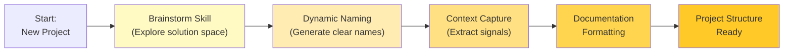
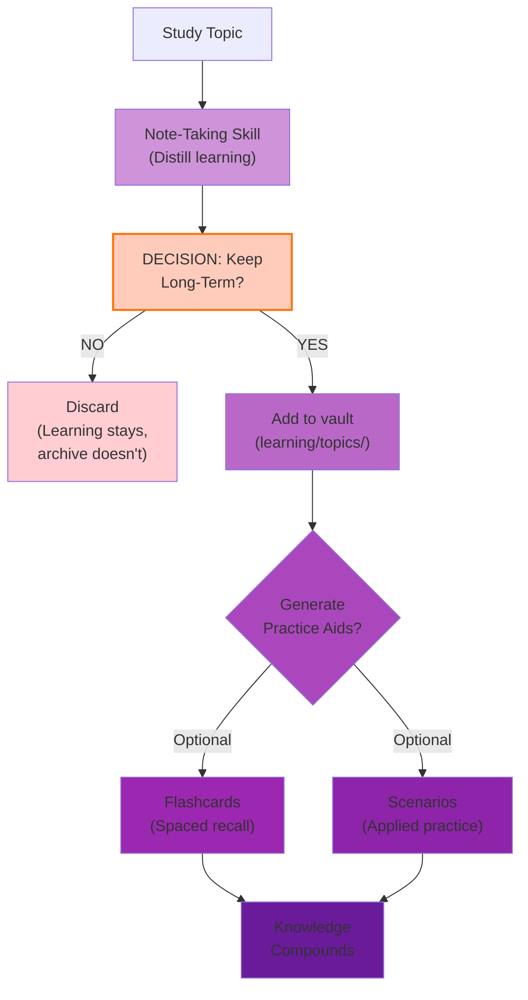
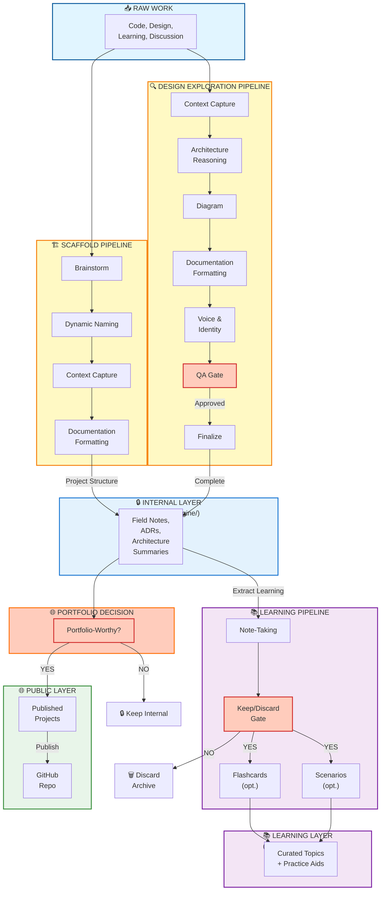
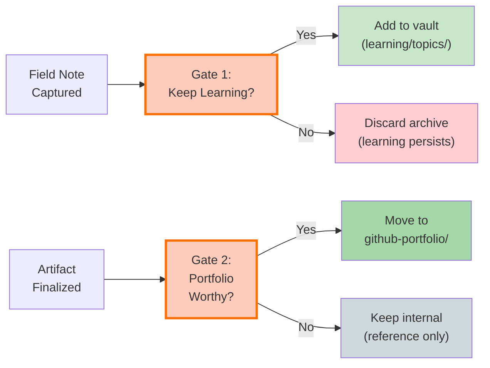

## Pipeline: Scaffold

**Output:** Named project with index structure ready for work

---

## Pipeline: Design Exploration

```mermaid
graph LR
    A["Raw Work"] --> B["Context Capture<br/>(What, why,<br/>constraints)"]
    B --> C["Architecture<br/>Reasoning<br/>(Why matters,<br/>trade-offs)"]
    C --> D["Diagram<br/>(Visualize<br/>structure)"]
    D --> E["Documentation<br/>Formatting<br/>(Structure<br/>consistently)"]
    E --> F["Voice<br/>(Apply identity<br/>& tone)"]
    F --> G["QA Gate<br/>(Check quality<br/>& completeness)"]
    G --> H["Finalize<br/>(Lock artifact,<br/>mark complete)"]
    H --> I["Internal Artifact<br/>(Vault-ready)"]
    
    style A fill:#e1f5ff
    style B fill:#b3e5fc
    style C fill:#81d4fa
    style D fill:#4fc3f7
    style E fill:#29b6f6
    style F fill:#03a9f4
    style G fill:#039be5,stroke:#d32f2f,stroke-width:2px
    style H fill:#0288d1
    style I fill:#0277bd
```

**Output:** Field notes, ADRs, or Architecture Summary — publication-ready internally

---

## Pipeline: Learning Cycle

**Output:** Curated long-term knowledge with optional reinforcement aids

---

## Complete System: Three Layers

---

## The 12 Skills & Their Application

| Skill | When Used | Transforms |
|-------|-----------|-----------|
| **Brainstorm** | Project start | Undefined space → Multiple options |
| **Dynamic Naming** | Project naming | Raw ideas → Clear descriptors |
| **Context Capture** | Work/learning complete | Raw experience → Structured signals |
| **Architecture Reasoning** | Explaining decisions | Decisions → Justified rationale |
| **Diagram** | When clarity needed | Complex systems → Visual models |
| **Note-Taking** | Learning moment | Study → Structured knowledge |
| **Flashcards** | Knowledge reinforcement | Notes → Recall testing |
| **Scenarios** | Applied learning | Knowledge → Practice situations |
| **Documentation Formatting** | Final polish | Rough artifact → Professional output |
| **Portfolio Narrative** | Before publication | Technical artifact → External story |
| **Voice** | Across all outputs | Variable tone → Consistent identity |
| **Observation Pattern** | Comparative analysis | Artifacts → Patterns across work |

---

## Decision Gates (Intentional Friction)

Each gate ensures only high-signal work advances. **This is where intentionality happens.**

---

## Orchestration Features

**Context Store:** Stateful coordination across skill pipeline  
**Skill Registry:** Logs execution, enables audit and observability  
**Policy Engine:** Enforces voice, naming, QA consistently  
**Run Traces:** Complete history → reproducibility  
**Non-destructive Saves:** Soft Save (iterate) vs Finalize (lock)  
**QA Gates:** Pre-publication quality bar checks

